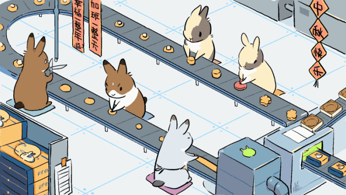

## Hi there👋🏻

I am Hongjing, currently a graduate student majoring in Electrical & Computer Engineering.

🌕🌖🌗🌘🌑🌒🌓🌔🌕

  

#### 🧀 Things I am currently working on:

- To be a better developer

#### 🥝 Things I am challenging myself with:

- Jogging
- Swimming
- **Keeping focused!!!**
- **Early to bed!!!**

#### 🥛 Things I value a lot:

- **Mental & physical health**

- ...

|  |  |
| ------------- | ------------- |

<!-- #### 🍬🧊 Programming languages: -->

	 
	 
	
  
	
  
  
  

<!-- #### 🍬🧊 Frameworks:

#### 🍬🧊 Databases: -->

Credits to:  [东予薏米](https://space.bilibili.com/23530/) for the awesome [GIF picture](images/rabbit.gif)
